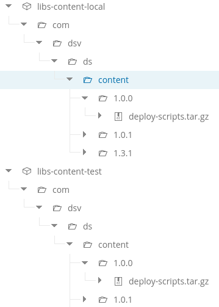

# Artifactory Scripts.
The purpose of these scripts is to interface to [Artifactory](https://www.jfrog.com/artifactory/).

The most common use case is when you need to interact with Artifactory from a shell of some type.
It is generally recommended to use standard build tools like, Maven, Ant, etc, for this uploading and retrieving artifacts.

## ArtifactoryHandler.groovy
The script uses jfrogs [Artifactory client](https://github.com/JFrogDev/artifactory-client-java). It also uses Kohsuke's
[args4j](http://args4j.kohsuke.org/) library for handling command line arguments.

The following functionality is available:

* List Repositories
* Find and Artifact
* Upload an Artifact
* Download an Artifact

It is **expected** that an artifact exists under a unique domain and version within a single repository. A domain is a
directory path and the version is expected to be parent directory of the artifact.

### Example:

* domain is: /com/dsv/ds/content/
* version is: 1.0.0
* artifact is: myZip.tar.gz

The full Artifactory path is: /com/dsv/ds/content/1.0.0/myZip.tar.gz. This path is unique to the repository but may exist
in another repository.

## Usage

Place the **value** of arguments in _single quotes_.

The web servers URL **should** end with a trailing slash. The script will append the _'artifactory'_ context.

The following arguments are **always** required.

* --action - The action to be performed, i.e., --action 'upload', --action 'download', --action 'find', etc.
* --web-server - The server to connect to, i.e., --web-server 'http://localhost:8081/'
* --userName - The user to connect to the Artifactory server with. **NOTE:** The user must have the proper rights to
perform the actions.
* --password - The users password.

The following arguments are dependent upon the action.

* --repository - The Artifactory repository. Required for **upload** and **download**.
* --version - The version of the artifact. Required for **upload** and **download**.
* --domain - The path to store the artifact on the Artifactory server or the path where it resides. Required for **upload**
and **download**.
* --artifact - The actual artifact. Required for **upload, download, find**.
* --location - The location of the artifact to **upload**. If not
set, then defaults to directory of **this** script.

### Find Artifact

The find will list all artifacts and the repository it belongs to that match the value of the --artifact argument.

If you don not provide --domain and --version arguments, the search is considered to be ambiguous and **could** return
more than one result.

If you refine the search by using the --repository and the --version arguments. Then the search is considered to be
unambiguous and only **one** result **should** be returned.

In either case, if nothing is found then the script will exit with 1.

>groovy artifactoryHandler.groovy --action 'find' --artifact 'args4j' --web-server 'http://localhost:8081/' --userName 'admin' --password 'password'

>Looking for artifact: args4j

>\-\-\-\-\-\-\-\-\-\-\-\-\-\-\-\-\-\-\-\-\-\-\-\-\-\-\-\-\-\-\-\-\-\-\-\-\-\-\-\-\-\-\-\-\-\-\-\-\-\-\-\-\-\-\-\-\-\-\-

>Found in Repository: jcenter-cache

>Path is: args4j/args4j/2.0.26/args4j-2.0.26.jar

>Found in Repository: jcenter-cache

>Path is: args4j/args4j/2.33/args4j-2.33.jar

### List Repositories

The list repos will list all **virtual**, **local** and **remote** repositories.

>groovy artifactoryHandler.groovy --action 'list-repos' --web-server 'http://localhost:8081/' --userName 'admin' --password 'password'

>Listing Repositories

>\-\-\-\-\-\-\-\-\-\-\-\-\-\-\-\-\-\-\-\-\-\-\-\-\-\-\-\-\-\-\-\-\-\-\-\-\-\-\-\-\-\-\-\-\-\-\-\-\-\-\-\-\-\-\-\-\-\-\-

>key :ext-release-local

>type : local

>description : Local repository for third party libraries

>url : http://localhost:8081/artifactory/ext-release-local

>\-\-\-\-\-\-\-\-\-\-\-\-\-\-\-\-\-\-\-\-\-\-\-\-\-\-\-\-\-\-\-\-\-\-\-\-\-\-\-\-\-\-\-\-\-\-\-\-\-\-\-\-\-\-\-\-\-\-\-

>key :jcenter

>type : remote

>description : Bintray Central Java repository

>url : http://jcenter.bintray.com

>\-\-\-\-\-\-\-\-\-\-\-\-\-\-\-\-\-\-\-\-\-\-\-\-\-\-\-\-\-\-\-\-\-\-\-\-\-\-\-\-\-\-\-\-\-\-\-\-\-\-\-\-\-\-\-\-\-\-\-

>key :plugins-snapshot

>type : virtual

>description : null

>url : http://localhost:8081/artifactory/plugins-snapshot

### Upload Artifact

The artifact to upload **must not** be ambiguous. Basically it must have unique path within a repository.
It is expected that the artifact follows the domain/version path in Artifactory as described above.

If an artifact which matches the domain/version/name already exists in the specified repository the script will exit with 1.

#### Example: Existing artifact

>groovy artifactoryHandler.groovy --action 'upload' --artifact 'deploy-scripts.tar.gz' --domain '/com/dsv/ds/content/' --location '/home/timothy/Documents/DSV' --repository 'libs-content-test' --version '1.3.8' --web-server 'http://localhost:8081/' --userName 'admin' --password 'password'

>Starting upload...

>Artifact already exists at: com/dsv/ds/content/1.3.8/deploy-scripts.tar.gz in repository: libs-content-test

>Exiting with (1)...

#### Example: Non Existing artifact

>groovy artifactoryHandler.groovy --action 'upload' --artifact 'deploy-scripts.tar.gz' --domain '/com/dsv/ds/content/' --location '/home/timothy/Documents/DSV' --repository 'libs-content-test' --version '1.4.1' --web-server 'http://localhost:8081/' --userName 'admin' --password 'password'

>Starting upload...

>Starting Upload of deploy-scripts.tar.gz to repository libs-content-test at com/dsv/ds/content/1.4.1

>Upload Completed on: Wed Apr 06 19:53:45 CEST 2016...

### Download Artifact

The artifact to download **must not** be ambiguous. Again basically it must have a unique path within the repository and it
**must** exist. If it doesn't the script will exit with 1. All artifacts are downloaded to the directory where the script
exists.

#### Example: Unambiguous Artifact

>groovy artifactoryHandler.groovy --action 'download' --artifact 'deploy-scripts.tar.gz' --domain '/com/dsv/ds/content/' --repository 'libs-content-test' --version '1.3.4' --web-server 'http://localhost:8081/' --userName 'admin' --password 'password'

>Starting download...

>Downloading deploy-scripts.tar.gz from folder: 1.3.4

>Artifact: deploy-scripts.tar.gz downloaded...

## Improvements

The following improvements would be nice to have:

* YAML config file. Should be able to provide a list of artifacts to upload/download from a specified repository. Good
for bulk actions.
* List all artifacts in a repository
* Clean a specified artifact
* Clean up running containers if tests fail

## Tests

I wanted to be able to automate the tests of the script against the latest version of Artifactory. The following 
approach to testing the script is what I **want** to be implemented. Unfortunately jFrog does not provide 
the REST interface with the open source version and also do not provide a dev license for pro version. 

Maybe they will some day but I doubt it. I had a bit of interaction with them regarding this and the answer is, well we
 have plenty of customers that are fine with this. So don't hold your breath...

* [Docker](https://www.jfrog.com/confluence/display/RTF/Docker+Repositories) image of Artifactory is used. Specifically
the **latest** open source version.
* Tests will check if container _artifactory_oss_latest_ is available on system. If not then test will pull the image and
start a container with this name.
 * Test will create any needed repositories or configurations needed for the container.
* Test will start the container.
* All user functionality will be tested along with all combinations of parameters.

I have started a shell script for this, but it is **not** finished and **can't** be used yet. Maybe never, which is why
 I haven't bothered to finish it :-( 

So for now you will need to:
 
* Pull the docker **pro** image
* Start it by hand
* Get a trial license and install it 
* Create the following **generic** repositories: libs-content-local and libs-content-test
* Run the ArtifactHandlerTest.groovy file from the command line 

Obviously this will require that [Docker](https://www.docker.com/) be installed on the system.
